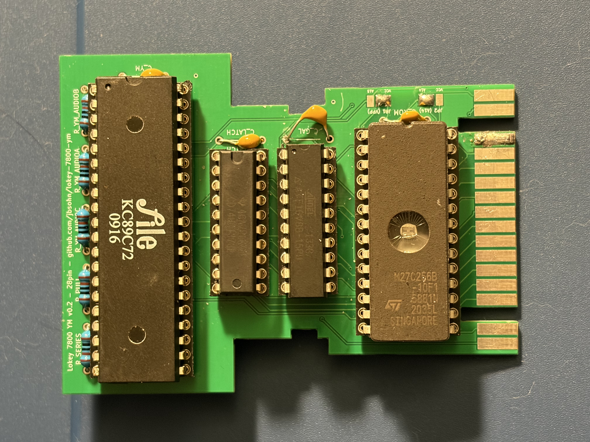

# Lokey 7800 YM2149

> **Status:** Physical v0.2 PCBs (28-pin and 32-pin) have arrived from the manufacturer. The **28-pin board is validated and playing clean audio** with two bodge wires: #1 for ROM `/OE` bus drive and #2 to connect the audio amp stage. Power-on reset behavior was fixed on hardware with a CD40106 Schmitt-trigger delay buffer and integrated into the v0.3 PCB layout — see [PCB v0.2 Errata & Revision Notes](docs/PCB-Revisions-v0.2.md). The 32-pin (bank-switched) board bring-up is still pending.

## Project Overview

The Atari 7800 community's favorite audio upgrades have a supply problem: POKEY clones run \$10 USD - \$40 USD each — when they're in stock — and the YM2151 has been out of production for decades, commanding collector prices used. The **Lokey 7800 YM2149** takes a different route: the **YM2149 PSG** — the Atari ST's sound chip — is still manufactured today as the **KC89C72** clone for about $2 USD. One in-production chip brings three-channel sound to the 7800, and with it a direct bridge to four decades of Atari ST music and a tracker ecosystem that is still alive and composing. Original YM2149 chips are also plentiful as used or New-Old-Stock (NOS) parts.

### What's in a Name?

The **Lokey** name is a triple-layered nod to the project's roots:

- **POKEY**: A respectful "cousin" to Atari’s legendary sound chip.
- **Low-Key**: Reflecting our philosophy of a minimalist, stealthy, and cost-effective design.
- **Loki**: Inspired by the Norse god of mischief—bringing a bit of technical "trickery" to the Atari 7800 bus.

The project views the **Atari ST** as a potential **Creation System**. With established trackers (like Protracker ST or Maxymiser), it offers a path for audio production, generating `.ym` chiptunes for use with our tools on the 7800.

The **Atari 7800** acts as the **Consumer** of these assets. By bridging the hardware gap, we hope to allow the 7800 to play music from the ST era or new compositions from modern trackers.

### Design Goals

- **In-Production Parts Only**: No POKEY or YM2151 unobtainium, and no expensive FPGAs. Every part on the BOM should be sourceable new today (e.g. the KC89C72 YM2149 clone).
- **No SMD**: Hand-solderable through-hole components only, so hobbyists without a hot air rework station can build and repair boards.
- **Low Cost**: Keep the total build cost minimal.
- **Time-Period Accurate**: Stay faithful to what would have been technically feasible/authentic to the Atari 7800/ST era, rather than leaning on modern shortcuts.

---

## Technical Specifications & Automation

- **Hardware Memory Mapping**:
  - `$0800`: YM2149 Address Register
  - `$0801`: YM2149 Data Register (Write-only, gated by `/RW`)
- **Board Variants**:
  - **28-Pin Board**: Single YM2149, ATF16V8B PLD, solder-jumper ROM size selection (16KB / 32KB / 48KB).
  - **32-Pin Board**: Single YM2149, ATF22V10 PLD, native DIP-32 socket with software bank switching via the YM IOA port (fixed 32KB code bank at `$8000–$FFFF` + switched 16KB data window at `$4000–$7FFF`, up to 256KB).
- **Automated PCB & PLD CI Pipeline**:
  - **GitHub Actions**: Rebuilds PLD logic (`.jed`) and both PCBs from source on every push/PR via a containerized toolchain (KiCad 9, Freerouting v2.4.1, galette 0.3.0). Tagged releases (`v*`) automatically package and publish Gerbers (`gerbers-28pin.zip`, `gerbers-32pin.zip`) and fusemaps to GitHub Releases.

---

## Development Environment & Requirements

### Option A: Docker Dev Container (Recommended — Zero Setup)

A preconfigured Docker Dev Container is provided in `.devcontainer/`. Opening the project in VS Code / GitHub Codespaces pre-loads a gold-standard environment matching CI:

- KiCad 10+ (`kicad-cli`)
- Java 25 & Freerouting CLI
- Node.js 20 & Bun
- `galette` 0.3.0 (PLD logic compiler)
- `ca65` & `ld65` (6502 assembly toolchain)

### Option B: Local Native Toolchain Requirements

If building natively outside the container, install the following requirements:

1. **6502 Toolchain**: `ca65` and `ld65` (from `cc65`), `a78tool` (from [`lokey-7800-tools`](https://github.com/jbsohn/lokey-7800-tools)), and `7800sign`.
2. **PLD Logic Assembler**: `galette` 0.3.0 (`cargo install galette --version 0.3.0`).
3. **PCB Layout & Routing**:
   - Node.js (v18+) & Bun (`npm install -g bun`) for `tscircuit` compilation in `pcb/`.
   - KiCad (v10.0+) with `kicad-cli` (no Python scripting needed).
   - Java JRE (21+). `make freerouting` downloads the pinned Freerouting 2.4.1 jar into `pcb/.tools/` (SHA-256 verified), and the `pcb*` targets fetch it automatically. Set `FREEROUTING_JAR` to use your own copy.

---

## Hardware & Media

### Hardware Prototype

### Web Emulator (Instant Play)

Test in-browser using custom **js7800** fork:
👉 **[Play YM2149 Demos in Browser](https://jbsohn.github.io/js7800-ym-player/)**

### Physical Hardware Test

---

## Repository Ecosystem & Documentation

This project is organized across 3 dedicated repositories:

1. **[lokey-7800-ym2149](https://github.com/jbsohn/lokey-7800-ym2149)** (This repo) — PCB hardware designs, PLD logic files, 6502 assembly drivers, and bank selection examples.
2. **[lokey-ym2149-tools](https://github.com/jbsohn/lokey-ym2149-tools)** — Generic YM2149 audio tools, compiler library (`ym-core`), and CLI (`lym`).
3. **[lokey-7800-tools](https://github.com/jbsohn/lokey-7800-tools)** — Atari 7800 utilities including `a78tool` (A78 ROM header utility).

### Technical Documentation

- **[Development Guide](CLAUDE.md)** — Technical standards, ca65 assembly rules, and build targets.
- **[Hardware & Wiring Specification](docs/Hardware.md)** — Shared memory mapping and connector/chip pinouts.
  - **[28-Pin Board Hardware Spec](docs/Hardware-28pin.md)** — 28-pin schematic, PLD pinout, jumper tables.
  - **[32-Pin Board Hardware Spec](docs/Hardware-32pin.md)** — 32-pin schematic, ATF22V10 pinout, bank switching layout.
- **[PCB Design & Routing Pipeline](docs/PCB.md)** — `tscircuit` React components, KiCad post-routing scripts, and Gerbers build pipeline.
- **[Emulator Support](docs/Emulation.md)** — A78 header spec and `a7800` / `js7800` / `test7800` emulator forks.

---

## Acknowledgements & Credits

- **Karri Kaksonen (karrika)**: For the excellent [Otaku-flash](https://github.com/karrika/Otaku-flash) project. We have integrated the **Stable Alpha** Atari 7800 cartridge footprints, symbols, and professional design rules from this MIT-licensed repository.
- **Simon Frankau ([galette](https://github.com/simon-frankau/galette))**: For the open-source **galette** logic assembler. It provides a modern, cross-platform toolchain for compiling ATF16V8B/ATF22V10 logic, saving us from legacy Windows tools.
- **Dan Boris (AtariHQ)**: For the indispensable [7800 Cartridge Technical Specifications](https://atarihq.com/danb/7800cart/a7800cart.shtml) and reference diagrams that made this hardware mapping possible.
- **Eagle (AtariAge)**: For the Atari 7800 cartridge audio design work that inspired and guided this circuit, originally shared in the [Atari 7800/YM2149 clone prototype](https://forums.atariage.com/topic/389754-atari-7800ym2149-clone-prototype/) AtariAge forum thread.
- **Ecernosoft**: For the insightful ideas and technical tips provided on the AtariAge forums, including the Pokey800 mapping recommendation.
- **Arnaud Carré (Leonard/OXG)**: For the pioneering [StSound](https://github.com/arnaud-carre/StSound) project and research into the Atari ST sound architecture.
- **The Atari Community**: We are grateful to the dedicated homebrew developers and fans keeping both 8-bit and 16-bit Atari platforms vibrant.

---

## License

Licensed under the **MIT License**. See [LICENSE](LICENSE) for details.
