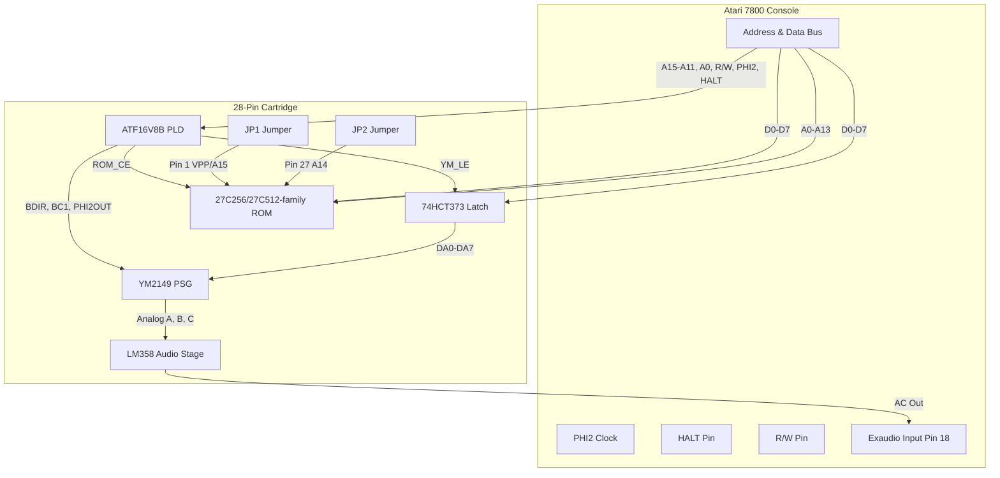

# 28-Pin Board — Theory of Operation & Hardware Spec

This document covers the **28-pin ROM board** (`pcb/28pin.circuit.tsx`): a single-YM2149 cartridge with solder-jumper ROM size selection (16KB–48KB). For shared memory mapping and cartridge connector pinouts, see [Hardware.md](Hardware.md). For the 32-pin bank-switched board, see [Hardware-32pin.md](Hardware-32pin.md).

---

## 1. Programmable Logic Device (ATF16V8B) & `galette`

The cartridge uses an **ATF16V8B** (or legacy **GAL16V8**) 20-pin PLD (`U_GAL`) to handle address decoding, bus control, and latch timing.

Logic source files are compiled into JEDEC fusemaps (`.jed`) using [**galette**](https://github.com/simon-frankau/galette), an open-source logic assembler:

```bash
make logic
```

### PLD Equations (`pld/rom_ym_28pin.pld`)

```cupl
PHI2OUT = PHI2
BDIR = /A15 * /A14 * /A13 * /A12 * A11 * /RW * HALT * PHI2
BC1  = /A15 * /A14 * /A13 * /A12 * A11 * /RW * /A0 * HALT * PHI2
YMLE = /A15 * /A14 * /A13 * /A12 * A11 * /RW * HALT * PHI2
/ROMCE = A15 * RW + A14 * RW
```

- **ROM Access (`$4000–$FFFF`)**: Drives `/ROMCE` low on reads (`RW=1`) when `A15=1` or `A14=1`.
- **YM Registers (`$0800–$0801`)**: Drives control signals (`BDIR`, `BC1`, `YMLE`) during write cycles (`RW=0`) when `A15..A12=0000` and `A11=1`.

---

## 2. System Architecture



---

## 3. Hardware Pinouts & Connections

### ATF16V8B PLD Pinout (`U_GAL`)

| Pin | Signal | Source / Destination |
| :--- | :--- | :--- |
| 1 | NC | Unused |
| 2 | **A15** | 7800 Address Bus (Cart Pin 17 / JP1 Right) |
| 3 | **A14** | 7800 Address Bus (Cart Pin 16 / JP2 Right) |
| 4 | **A0** | 7800 Address Bus (Cart Pin 26 / ROM Pin 10) |
| 5 | **HALT** | 7800 Maria Halt Signal (Cart Pin 2) |
| 6 | **R/W** | 7800 CPU R/W Line (Cart Pin 1) |
| 7 | **PHI2** | 7800 CPU Clock (Cart Pin 32) |
| 8 | **A13** | 7800 Address Bus (Cart Pin 15 / ROM Pin 26) |
| 9 | **A12** | 7800 Address Bus (Cart Pin 8 / ROM Pin 2) |
| 10 | GND | Ground |
| 11 | **A11** | 7800 Address Bus (Cart Pin 10 / ROM Pin 23) |
| 15 | **YM_LE** | Latch Enable → 74HCT373 Pin 11 |
| 16 | **PHI2OUT** | Buffered Clock → U_YM Pin 22 |
| 17 | **BC1** | → U_YM Pin 29 |
| 18 | **BDIR** | → U_YM Pin 27 |
| 19 | **!ROM_CE** | → U_ROM Pin 20 (/CE) |
| 20 | VCC | +5V |

### 27C256 EPROM (28-Pin DIP, 32KB ROM)

| Pin (Left Side) | Signal | Pin (Right Side) | Signal |
| :---: | :--- | :---: | :--- |
| **1** | **VPP** *(to JP1 Center pad)* | **28** | **VCC** (+5V) |
| **2** | **A12** *(Cart Pin 8 / GAL Pin 9)* | **27** | **A14** *(to JP2 Center pad)* |
| **3** | **A7** *(Cart Pin 19)* | **26** | **A13** *(Cart Pin 15 / GAL Pin 8)* |
| **4** | **A6** *(Cart Pin 20)* | **25** | **A8** *(Cart Pin 12)* |
| **5** | **A5** *(Cart Pin 21)* | **24** | **A9** *(Cart Pin 11)* |
| **6** | **A4** *(Cart Pin 22)* | **23** | **A11** *(Cart Pin 10 / GAL Pin 11)* |
| **7** | **A3** *(Cart Pin 23)* | **22** | **!OE** *(Output Enable → GND)* |
| **8** | **A2** *(Cart Pin 24)* | **21** | **A10** *(Cart Pin 9)* |
| **9** | **A1** *(Cart Pin 25)* | **20** | **!CE** *(Chip Enable ← GAL Pin 19)* |
| **10** | **A0** *(Cart Pin 26 / GAL Pin 4)* | **19** | **D7** *(Cart Pin 7 / Latch Pin 18)* |
| **11** | **D0** *(Cart Pin 27 / Latch Pin 3)* | **18** | **D6** *(Cart Pin 6 / Latch Pin 17)* |
| **12** | **D1** *(Cart Pin 28 / Latch Pin 4)* | **17** | **D5** *(Cart Pin 5 / Latch Pin 14)* |
| **13** | **D2** *(Cart Pin 29 / Latch Pin 7)* | **16** | **D4** *(Cart Pin 4 / Latch Pin 13)* |
| **14** | **GND** (Ground) | **15** | **D3** *(Cart Pin 3 / Latch Pin 8)* |

### 74HCT373 Octal Latch (`U_LATCH`)

The YM2149 uses a multiplexed address/data bus (`DA0–DA7`). When the CPU writes to `$0800/$0801`, the PLD asserts `YM_LE` high to store data bus lines `D0–D7` into the latch to drive `DA0–DA7`.

| Latch Pin | Signal | Connection |
| :--- | :--- | :--- |
| 1 | ~OE | Ground |
| 2–9 | Q0–Q7 | U_YM DA0–DA7 |
| 3–18 | D0–D7 | 7800 Data Bus D0–D7 |
| 11 | LE | PLD Pin 15 (`YM_LE`) |
| 20 | VCC | +5V |
| 10 | GND | Ground |

### YM2149 Connections (`U_YM`)

| YM Pin | Signal | Connection |
| :--- | :--- | :--- |
| 22 | CLOCK | PHI2OUT (PLD Pin 16) |
| 27 | BDIR | PLD Pin 18 |
| 29 | BC1 | PLD Pin 17 |
| 28 | BC2 | VCC |
| 25 | A8 | VCC |
| 24 | !A9 | GND |
| 23 | !RESET | RESET_DELAYED (CD40106/74HC14 Schmitt-trigger delay) |
| 30–37 | DA7–DA0 | 74HCT373 Q7–Q0 |

---

## 4. Hardware Reset & Audio Stage

- **Reset Delay** (confirmed on hardware 2026-09-17 — replaces the original passive RC network, which was too slow/analog to survive BIOS RAM-test bus traffic aliased onto `$0800`, see `docs/PCB-Revisions-v0.2.md` §3): a CD40106 hex Schmitt-trigger inverter, two gates wired as a non-inverting buffer, holds Pin 23 at hard GND through BIOS boot (~1.9s) then releases it to VCC — driving Pin 23 directly, no separate pull-up needed.
  - RC timing: R=220kΩ (VCC → node), C=10µF (node → GND, electrolytic, `+` on the node side).
  - Wiring: Pin 1 (gate 1 in) = RC node · Pin 2 (gate 1 out) → Pin 3 (gate 2 in) · Pin 4 (gate 2 out) → YM Pin 23 · Pin 14 = VCC · Pin 7 = GND · Pins 5/9/11/13 (unused gate inputs) → GND · Pins 6/8/10/12 (unused gate outputs) left floating.
  - Old `R_RESET`/`C_RESET` pads are no longer used by this circuit.
  - CD40106 is the part currently in use, confirmed clean on hardware.
  - Still on hand-wired/DIP prototype; PCB source (`pcb/28pin.circuit.tsx`) and layout haven't been updated yet — pending the planned v0.3 rework.
- **Audio Stage**: Based on and adapted from Eagle's cartridge audio design on the AtariAge forums ([thread discussion](https://forums.atariage.com/topic/389754-atari-7800ym2149-clone-prototype/)).
  - **Channel Summing**: `R_YM_AUDIOA/B/C` = 3kΩ (YM `ANALOG A/B/C` → `SUM_NODE`), `R_FB` = 1kΩ (`SUM_NODE` → `OPAMP_OUT`). Each channel gets ~1/3 gain into the LM358 inverting summing junction, so a full 3-voice chord at max volume lands back around a single channel's original headroom instead of stacking 3x — avoids clipping the single-supply LM358 near its rails. (Originally 1kΩ per channel/unity gain; raised to 3kΩ for headroom margin, not yet bench-confirmed against a full 3-voice chord.)
  - `R_PULL` = 1kΩ (`OPAMP_OUT` → GND), `R_SERIES` = 1kΩ (`OPAMP_OUT` → `CAP_PLUS`) into `C_AUDIO_OUT` (10µF) AC-coupling to `Exaudio` — high-pass corner ≈ 16 Hz, well below the audio band.

---

## 5. Solder Jumper Configurations (ROM Size)

| Jumper | Left pad | Right pad | Purpose |
| :--- | :--- | :--- | :--- |
| **JP1** | VCC | A15 | Pin 1 (VPP/A15): tie high for 16K/32K, or route A15 for 64K |
| **JP2** | VCC | A14 | Pin 27 (A14): tie high for 16K, or route A14 for 32K/64K |

| ROM size | JP1 (Pin 1, VPP/A15) | JP2 (Pin 27, A14) | Accessible Region |
| :--- | :--- | :--- | :--- |
| **16 KB (27C128)** | Bridge Left (VCC) | Bridge Left (VCC) | 16KB, mirrored across `$4000–$FFFF` |
| **32 KB (27C256)** | Bridge Left (VCC) | Bridge Right (A14) | 32KB (`$8000–$FFFF`) |
| **64 KB (27C512)** | Bridge Right (A15) | Bridge Right (A14) | 48KB (`$4000–$FFFF` unmirrored) |

> **Note on 64KB ROMs:** `pld/rom_ym_28pin.pld` asserts `/ROM_CE` whenever `RW=1` and (`A15=1` OR `A14=1`). Driving ROM A15/A14 directly from the console bus maps `$8000–$FFFF` (32KB) and `$4000–$7FFF` (16KB) to distinct physical areas, yielding 48KB of addressable ROM space.
