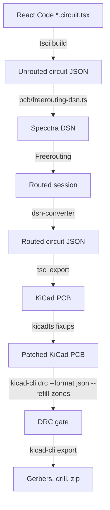

# PCB Design & Automated Routing Pipeline

This document details the code-driven PCB layout, post-routing pipeline, and build system for the Atari 7800 YM2149 sound card cartridge.

---

## PCB Overview

Each board is a 2-layer cartridge PCB designed to fit standard Atari 7800 cartridge shells. Component placements, net connections, and board outlines are defined using **tscircuit** (React TSX).

- **`pcb/28pin.circuit.tsx`**: Single YM2149, ATF16V8B PLD, solder-jumper ROM size selection. Hardware spec: [Hardware-28pin.md](Hardware-28pin.md).
- **`pcb/32pin.circuit.tsx`**: Single YM2149, ATF22V10 PLD, native DIP-32 socket with software bank switching. Hardware spec: [Hardware-32pin.md](Hardware-32pin.md).
- **v0.2 Hardware Errata & Revisions**: [PCB-Revisions-v0.2.md](PCB-Revisions-v0.2.md) (known physical board errata and planned fixes for v0.3).

---

## Compilation & Routing Pipeline

The whole flow is TypeScript (`pcb/build-pcb.ts`, run with Bun). KiCad is only used through its stable `kicad-cli` for zone refill, DRC and Gerber export; there is no Python or `pcbnew` scripting.



### Pipeline Steps (`pcb/build-pcb.ts`)

1. **Build**: `tsci build` compiles the React TSX into an unrouted circuit JSON.
2. **DSN** (`pcb/freerouting-dsn.ts`): converts the circuit JSON to Specctra DSN with tscircuit's `dsn-converter`, then patches what the converter gets wrong:
   - one image per part (the converter reuses one part's pins for every same-size part, so pads end up in the wrong place);
   - unique pin ids for pads without a source port, and a one-pin net for every unused pad so it acts as an obstacle;
   - drops the duplicate 2-pin nets that hand-placed `<trace>` elements create;
   - real board outline, GND copper pours as planes, edge-connector clearance rules, and a 0.2mm minimum clearance.
   - **Self-check** (`verifyDsn`): before Freerouting runs, the build verifies every assumption these patches rely on (one image per part, unique pin ids, every pad present at the right place, every pin in exactly one net, boundary, planes and clearance rules applied). If a `dsn-converter` upgrade changes its output, the build fails with a specific message instead of misplacing pads.
3. **Freerouting**: routes every net with the documented CLI (`-de`/`-do`/`--gui.enabled=false`, `-mt 0` to skip the optimizer). After the session is written, a second documented `-drc` invocation checks `unconnected_items`; the build fails if any remain.
4. **Merge**: routes and vias are merged back into the circuit JSON (all vias are through vias).
5. **Export & fix up**: `tsci export` writes the KiCad board; `kicadts` then raises reference-designator text to at least 0.8mm (thickness 0.1mm), sets GND zone `min_thickness` to 0.15mm and the revision (`Rev1`). The `.kicad_pro` DRC minimums come from the `<board>` itself (`minTraceWidth`, via and edge clearances), and `.kicad_dru` waives edge clearance for connector `J1` and the connector-notch nets.
6. **Zone refill + DRC gate**: `kicad-cli pcb drc --format json --severity-error --severity-warning --refill-zones --save-board`. tscircuit exports the copper pour before routing, so this refill is required. The gate reads the documented JSON schema (`https://schemas.kicad.org/drc.v1.json`) and fails on any short, clearance or track-width violation, or any unconnected item other than the known GND zone-fill fragments. It also fails if the report omits the error or warning severity, if the `.kicad_pro` ignores a check the gate depends on, or if a violation has no `type` (it cannot be classed as cosmetic).
7. **Gerbers**: writes Gerber and drill files to `pcb/build/gerbers/`, sets `Finish: ENIG` and the revision in the job file, and zips them to `pcb/build/gerbers.zip` (plus `gerbers-<board>.zip`, `index-<board>.kicad_pcb` and `index-<board>-drc.json`).

`make pcb-check` runs steps 1-6 for both boards without writing Gerbers.

---

## Environment Setup & Build Commands

### Setup Options
- **Option A (Docker Dev Container — Recommended):** Open `.devcontainer/` in VS Code. Pre-loaded with KiCad, Java 25, Freerouting, Node.js/Bun, `galette`, and `ca65`/`ld65` (the PCB build needs KiCad 10 or newer).
- **Option B (Native Requirements):**
  - **Bun**: runs `tscircuit` and the PCB build script (`bun install` in `pcb/`).
  - **KiCad (v10.0+)**: the `kicad-cli` executable (zone refill needs `pcb drc --refill-zones`, added in KiCad 10).
  - **Java JRE (21+) & Freerouting**: `FREEROUTING_JAR` set to `freerouting-2.4.1.jar` (or `freerouting` binary on `PATH`).

### Build Commands

```bash
# 1. Install dependencies
cd pcb && bun install

# 2. Build 28-pin PCB Gerbers
make pcb-28pin

# 3. Build 32-pin PCB Gerbers
make pcb-32pin   # or `make pcb`

# 4. Generate schematic SVG diagrams
make schematic-28pin
make schematic-32pin

# 5. Generate board SVG/PNG previews
make previews-28pin
make previews-32pin
```
