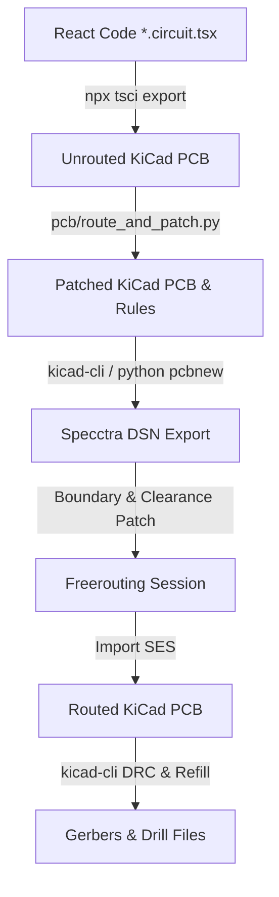

# PCB Design & Automated Routing Pipeline

This document details the code-driven PCB layout, post-routing pipeline, and build system for the Atari 7800 YM2149 sound card cartridge.

---

## PCB Overview

Each board is a 2-layer cartridge PCB designed to fit standard Atari 7800 cartridge shells. Component placements, net connections, and board outlines are defined using **tscircuit** (React TSX).

- **`pcb/28pin.circuit.tsx`**: Single YM2149, ATF16V8B PLD, solder-jumper ROM size selection. Hardware spec: [Hardware-28pin.md](Hardware-28pin.md).
- **`pcb/32pin.circuit.tsx`**: Single YM2149, ATF22V10 PLD, native DIP-32 socket with software bank switching. Hardware spec: [Hardware-32pin.md](Hardware-32pin.md).
- **v0.2 Hardware Errata & Revisions**: [PCB-Revisions-v0.2.md](PCB-Revisions-v0.2.md) (known physical board errata and planned fixes for v0.3).

---

## Compilation & Routing Pipeline



### Pipeline Steps (`pcb/route_and_patch.py`)

1. **Export**: Compiles the React TSX file into an unrouted KiCad board (`.kicad_pcb`).
2. **Patch Design Settings**:
   - Cleans up dummy `tscircuit:Unknown` footprint stubs.
   - Standardizes silkscreen text dimensions (height/width ≥ 0.8mm, thickness ≥ 0.1mm).
   - Configures GND copper pours to clear isolated islands (`SetIslandRemovalMode(0)`) and sets `min_thickness` to 0.15mm.
   - Applies custom rules (`.kicad_dru`) waiving edge clearance specifically for connector `J1` pads.
3. **DSN Export**: Exports Specctra DSN format via `pcbnew` Python API.
4. **DSN Patching**: Extends bottom boundary coordinate to `-140.2mm` to provide clearance for edge-connector routing.
5. **Freerouting**: Runs Freerouting CLI to autoroute all traces.
6. **Import & DRC**: Imports `.ses` file into `.kicad_pcb`, refills copper zones, and runs `kicad-cli` DRC.
7. **Export Gerbers**: Writes manufacturing files to `pcb/build/gerbers/`.

---

## Environment Setup & Build Commands

### Setup Options
- **Option A (Docker Dev Container — Recommended):** Open `.devcontainer/` in VS Code. Pre-loaded with KiCad 9, Java 25, Freerouting, Node.js/Bun, `galette`, and `ca65`/`ld65`.
- **Option B (Native Requirements):**
  - **Node.js (v18+) & Bun (`npm install -g bun`)**: Required for `tscircuit` compilation.
  - **KiCad (v9.0+)**: `kicad-cli` executable and `pcbnew` Python module.
  - **Java JRE (21+) & Freerouting**: `FREEROUTING_JAR` set to `freerouting-2.4.1.jar` (or `freerouting` binary on `PATH`).

### Build Commands

```bash
# 1. Install dependencies
cd pcb && npm install

# 2. Build 28-pin PCB Gerbers
make pcb-28pin

# 3. Build 32-pin PCB Gerbers
make pcb-32pin   # or `make pcb`

# 4. Generate schematic SVG diagrams
make schematic-28pin
make schematic-32pin

# 5. Generate board SVG/PNG previews
make previews-28pin
make previews-32pin
```
