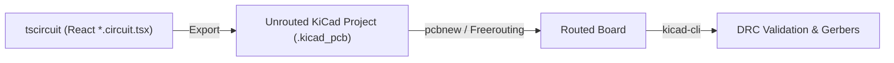

# PCB Design & Automated Routing Pipeline

This document details the code-driven PCB layout, post-routing pipeline, and build system for the Atari 7800 YM2149
sound card cartridge.

---

## PCB Overview

The primary project boards are 2-layer cartridge PCBs designed to fit standard Atari 7800 cartridge shells. Both
cartridges natively accept standard, authentic through-hole DIP-40 sound chips (**YM2149**, **KC89C72**, or
**AY-3-8910**). An **optional** daughterboard module is also provided. Component placements, net connections, and board
outlines are defined using **tscircuit** (React TSX).

- **`pcb/28pin.circuit.tsx` (Primary Cartridge)**: Single YM2149, ATF16V8B PLD, solder-jumper ROM size selection.
  Hardware spec: [Hardware-28pin.md](Hardware-28pin.md).
- **`pcb/32pin.circuit.tsx` (Primary Cartridge)**: Single YM2149, ATF22V10 PLD, native DIP-32 socket with software bank
  switching. Hardware spec: [Hardware-32pin.md](Hardware-32pin.md).
- **`pcb/ym2149.circuit.tsx` (OPTIONAL Daughterboard Carrier)**: ATmega324-based drop-in replacement carrier module
  (40-pin DIP footprint). **This board is strictly optional**; standard cartridges do not require it and run natively
  with authentic DIP-40 PSG chips. Bill of Materials: [BOM-ym2149.md](BOM-ym2149.md).
- **v0.2 Hardware Errata & Revisions**: [PCB-Revisions-v0.2.md](PCB-Revisions-v0.2.md) (known physical board errata and
  planned fixes for v0.3).

---

## Visual Previews

> [!NOTE]
> These previews link to the [latest GitHub Release](https://github.com/jbsohn/lokey-7800-ym2149/releases/latest) build
artifacts, reflecting the most recently tagged `v*` release.
> The **28-Pin** and **32-Pin** boards are the primary cartridge PCBs. The **YM2149 Daughterboard** is an **optional**
drop-in module for the 40-pin sound chip socket.

### 28-Pin Board Previews

|                                                                                                        Front View (Top Copper)                                                                                                        |                                                                                                     Back View (Bottom Copper)                                                                                                      |                                                                                                    3D Render (Isometric)                                                                                                     |
|:-------------------------------------------------------------------------------------------------------------------------------------------------------------------------------------------------------------------------------------:|:----------------------------------------------------------------------------------------------------------------------------------------------------------------------------------------------------------------------------------:|:----------------------------------------------------------------------------------------------------------------------------------------------------------------------------------------------------------------------------:|
| [](https://github.com/jbsohn/lokey-7800-ym2149/releases/latest/download/pcb_front_28pin.png) | [](https://github.com/jbsohn/lokey-7800-ym2149/releases/latest/download/pcb_back_28pin.png) | [](https://github.com/jbsohn/lokey-7800-ym2149/releases/latest/download/pcb_3d_28pin.png) |

### 32-Pin Board Previews

|                                                                                                        Front View (Top Copper)                                                                                                        |                                                                                                     Back View (Bottom Copper)                                                                                                      |                                                                                                    3D Render (Isometric)                                                                                                     |
|:-------------------------------------------------------------------------------------------------------------------------------------------------------------------------------------------------------------------------------------:|:----------------------------------------------------------------------------------------------------------------------------------------------------------------------------------------------------------------------------------:|:----------------------------------------------------------------------------------------------------------------------------------------------------------------------------------------------------------------------------:|
| [](https://github.com/jbsohn/lokey-7800-ym2149/releases/latest/download/pcb_front_32pin.png) | [](https://github.com/jbsohn/lokey-7800-ym2149/releases/latest/download/pcb_back_32pin.png) | [](https://github.com/jbsohn/lokey-7800-ym2149/releases/latest/download/pcb_3d_32pin.png) |

### YM2149 Daughterboard Previews (Optional)

|                                                                                                         Front View (Top Copper)                                                                                                         |                                                                                                      Back View (Bottom Copper)                                                                                                       |                                                                                                     3D Render (Isometric)                                                                                                      |
|:---------------------------------------------------------------------------------------------------------------------------------------------------------------------------------------------------------------------------------------:|:------------------------------------------------------------------------------------------------------------------------------------------------------------------------------------------------------------------------------------:|:------------------------------------------------------------------------------------------------------------------------------------------------------------------------------------------------------------------------------:|
| [](https://github.com/jbsohn/lokey-7800-ym2149/releases/latest/download/pcb_front_ym2149.png) | [](https://github.com/jbsohn/lokey-7800-ym2149/releases/latest/download/pcb_back_ym2149.png) | [](https://github.com/jbsohn/lokey-7800-ym2149/releases/latest/download/pcb_3d_ym2149.png) |

> [!NOTE]
> The 3D renders show bare copper/silkscreen/drill geometry without component bodies — the `tscircuit`-generated
footprints don't currently have 3D models (STEP/WRL) assigned, so chips, connectors, and passives don't appear as solid
parts yet.

---

## Compilation & Routing Pipeline

The design layout is defined in React code using `tscircuit`. TSCircuit generates the schematic, component placement, netlist, and board outline. The unrouted design is then handed off to KiCad, where autorouting is performed and production fabrication files (Gerbers, drill, and position files) are verified and exported.


```mermaid
graph LR
    A["tscircuit (React *.circuit.tsx)"] -->|Export| B["Unrouted KiCad Project (.kicad_pcb)"]
    B -->|pcbnew / Freerouting| C["Routed Board"]
    C -->|kicad-cli| D["DRC Validation & Gerbers"]
```

### Workflow Summary

1. **Schematic & Placement**: React components define parts, pins, nets, and physical layout in `pcb/*.circuit.tsx`.
2. **Export to KiCad**: `tsci export` generates the unrouted `.kicad_pcb` board file, netlist, and design constraints.
3. **Routing**: The unrouted board is bridged to Freerouting via KiCad (`pcbnew` Specctra DSN export and SES session import) to complete track routing and through-vias.
4. **DRC & Gerbers**: `kicad-cli` refills copper pours, executes the Design Rules Check (DRC), and outputs fabrication Gerbers, drill files, and 3D preview renders.

---

## Environment Setup & Build Commands

### Setup Options

- **Option A (Docker Dev Container — Recommended):** Open `.devcontainer/` in VS Code. Pre-loaded with KiCad, Java 25,
  Freerouting, Node.js/Bun, `galette`, and `ca65`/`ld65` (the PCB build needs KiCad 10 or newer).
- **Option B (Native Requirements):**
    - **Bun**: runs `tscircuit` and the PCB build script (`bun install` in `pcb/`).
    - **KiCad (v10.0+)**: the `kicad-cli` executable (zone refill needs `pcb drc --refill-zones`, added in KiCad 10).
    - **Java JRE (21+) & Freerouting**: `make freerouting` downloads the pinned 2.4.1 jar into `pcb/.tools/` and
      verifies its SHA-256; the `pcb*` targets do this automatically. To use your own copy, set `FREEROUTING_JAR` to a
      jar (or `FREEROUTING_BIN` to a `freerouting` executable).

### Build Commands

```bash
# 1. Install dependencies
cd pcb && bun install

# 2. Build 28-pin PCB Gerbers
make pcb-28pin

# 3. Build 32-pin PCB Gerbers
make pcb-32pin   # or `make pcb`

# 4. Build YM2149 daughterboard Gerbers
make pcb-ym2149

# 5. Generate schematic SVG/PNG diagrams
make schematic-28pin
make schematic-32pin
make schematic-ym2149

# 6. Generate board SVG/PNG previews and 3D renders
make previews-28pin
make previews-32pin
make previews-ym2149
```
